# 环境配置

以下是Windows10下开发环境安装过程，Linux和Mac请自行安装。

## 编译系统

### 下载 
1. [清华源](https://mirrors.tuna.tsinghua.edu.cn/)
2. 获取下载链接 
   <div align=center> 
      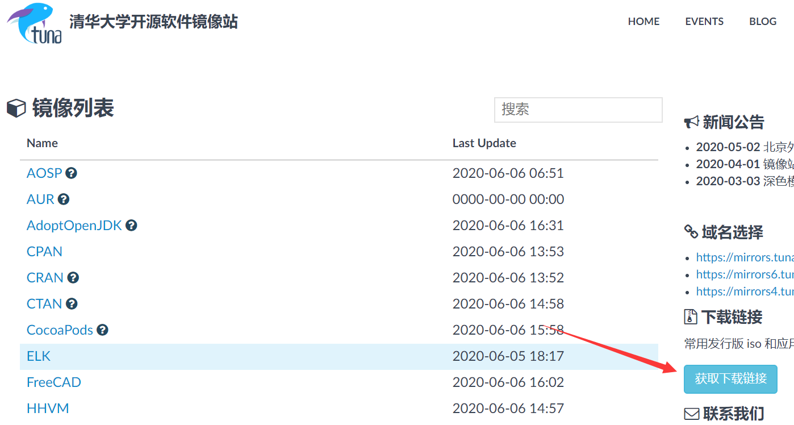
   </div> 
3. 应用软件 
   <div align=center> 
      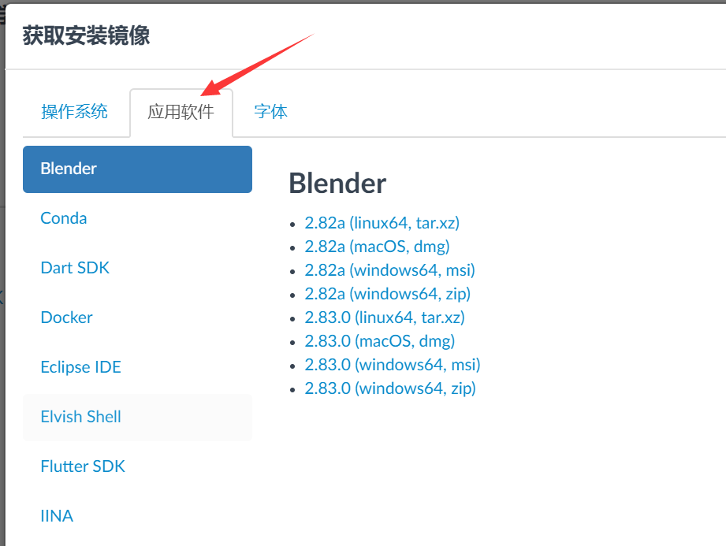
   </div> 
4. TeX排版系统 
   <div align=center> 
      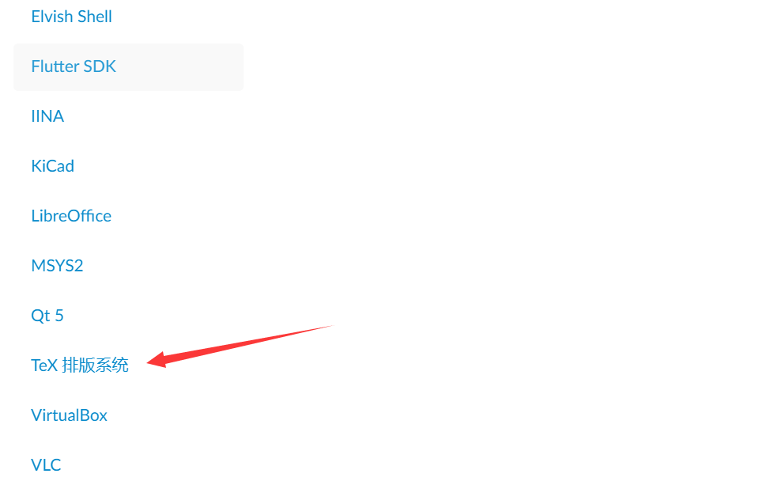
   </div> 
5. Windows和Linux 下载 TeXLive 
   <div align=center> 
      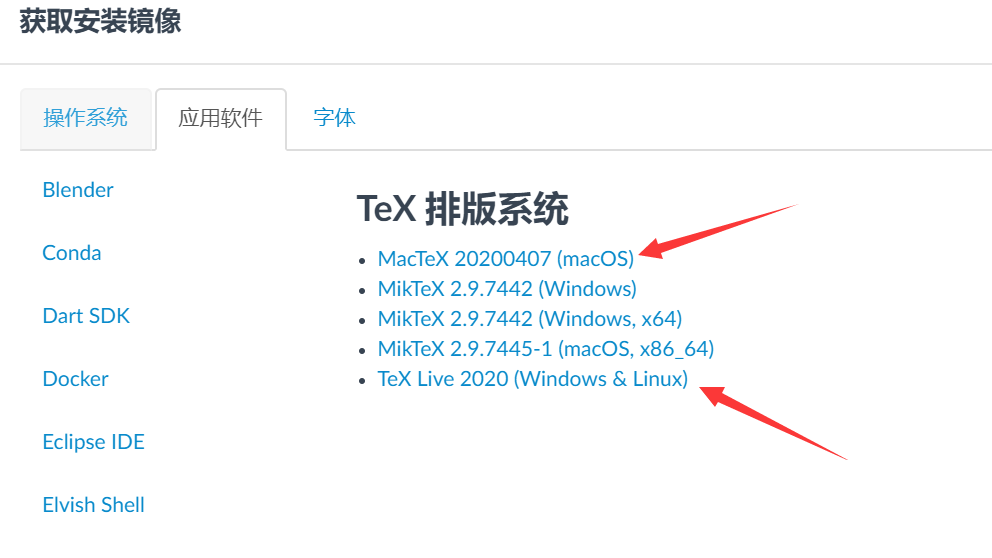
   </div> 
6. MacOS 下载 MacTeX


### 安装
1. 安装过程相当长，大概要一个多小时
2. 用虚拟光驱加载iso文件，或者直接解压缩
   <div align=center> 
      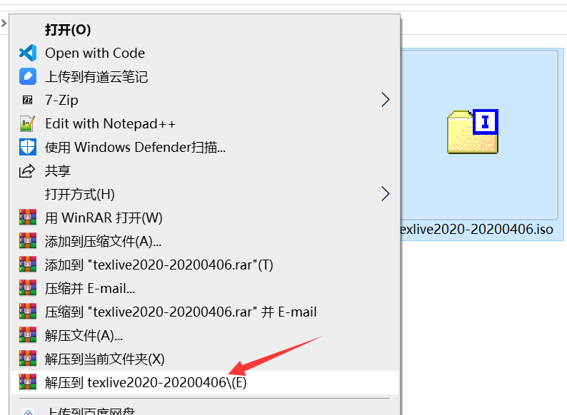
   </div> 
3. 双击运行 install-tl-windows.bat
   <div align=center> 
      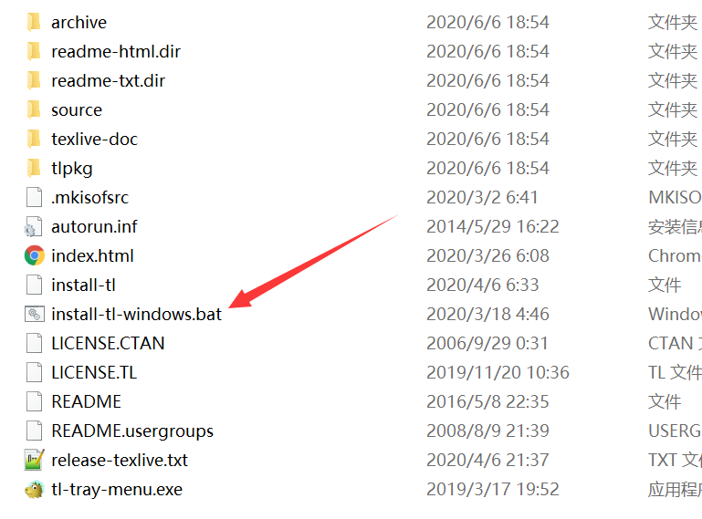
   </div> 
4. 可以修改一下安装目录
   <div align=center> 
      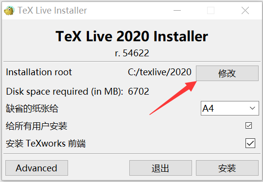
   </div> 
5. 安装过程，非常缓慢
   <div align=center> 
      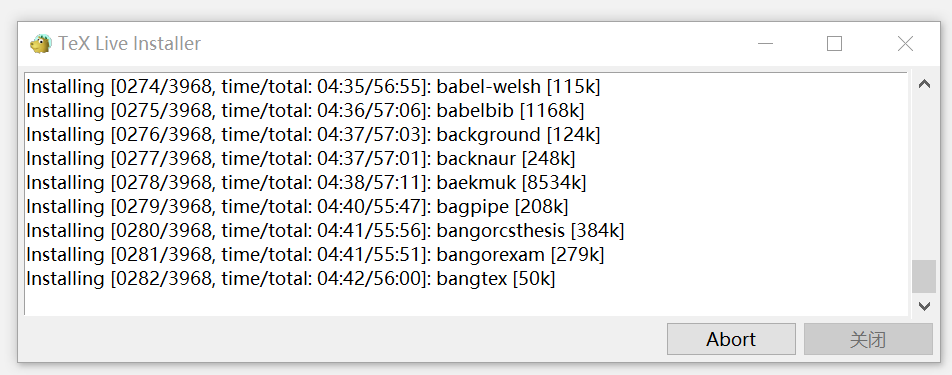
   </div> 
6. 安装完毕
   <div align=center> 
      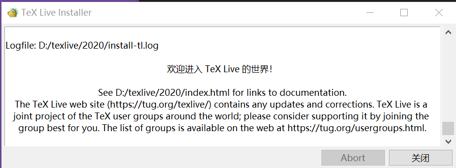
   </div> 
7. 测试，在cmd中运行 tex -v， 
   <div align=center> 
      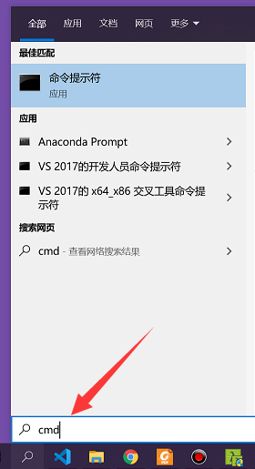
   </div> 
8. 看到版本号表示安装成功
   <div align=center> 
      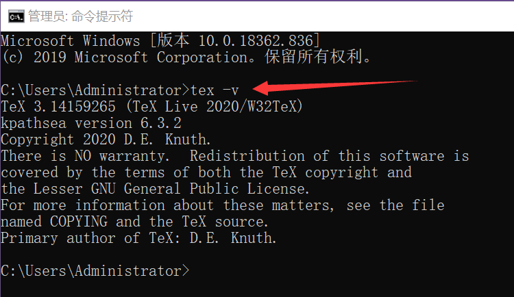
   </div> 


## 编辑软件

### 下载 
1. [TeXstudio官网](http://texstudio.sourceforge.net/)
2. Download 
   <div align=center> 
      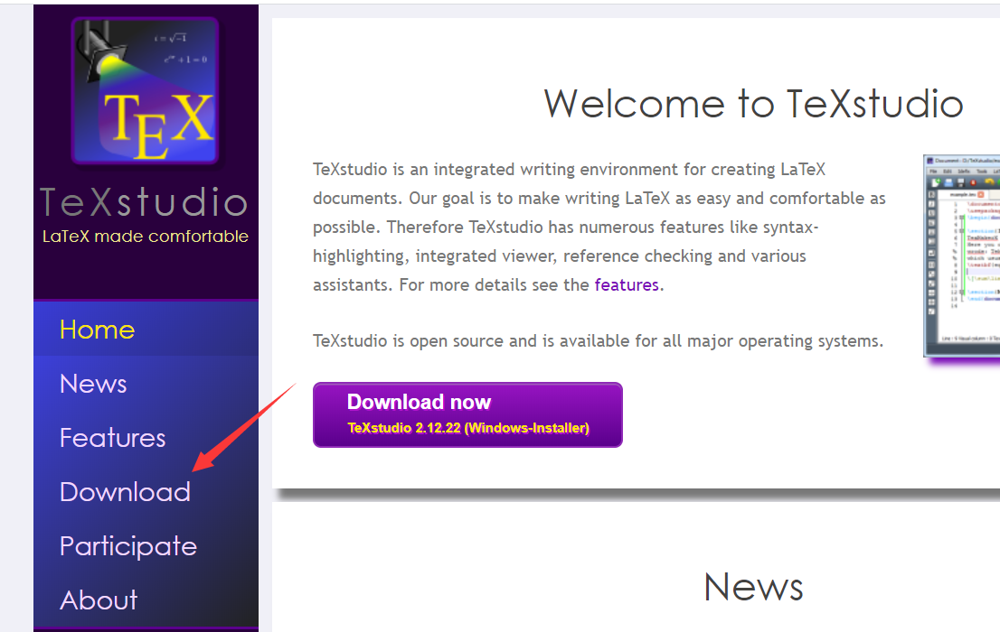
   </div> 
3. 根据系统选择安装包
   <div align=center> 
      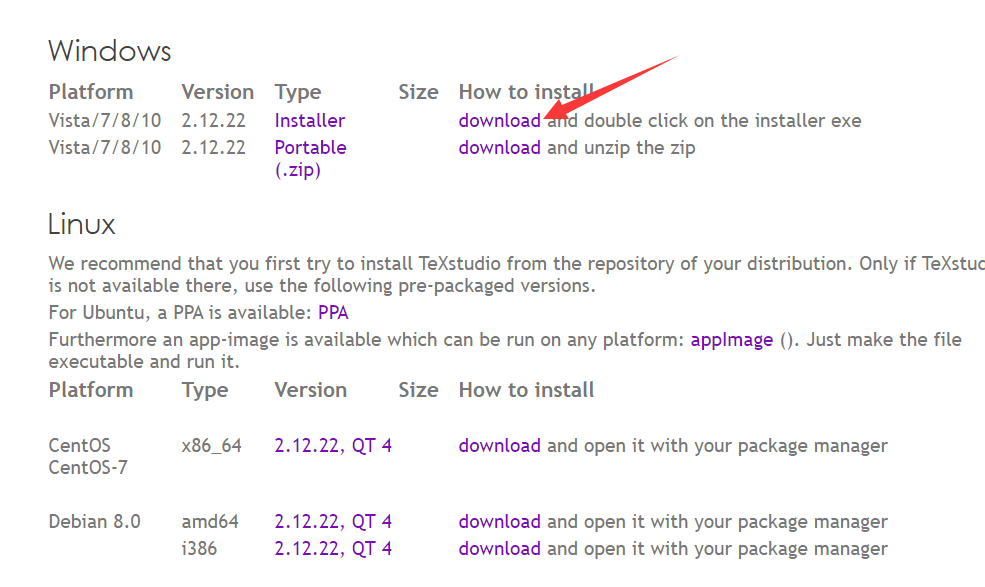
   </div> 

### 安装和配置
1. 双击运行 texstudio-version-win-qt5 进行安装
2. 安装完成后，如果桌面上没有TeXstudio，在开始菜单里找找
   <div align=center> 
      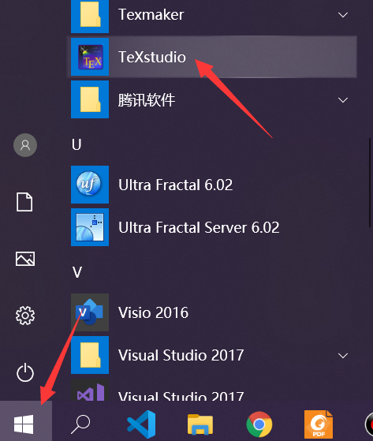
   </div>  
3. 选项 -> 设置TeXstudio
   <div align=center> 
      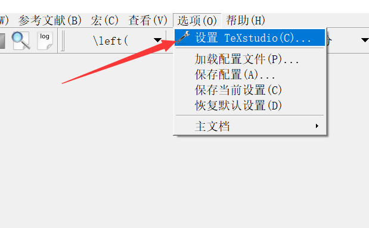
   </div>  
4. 构建 -> 默认编译器 -> XeLaTeX
   <div align=center> 
      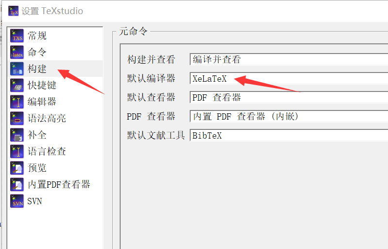
   </div>  

### VsCode + 插件 (仅供参考)
1. 我们也可以使用VsCode + 插件的方式来编辑编译Tex，比较适合喜欢折腾的用户
2. 安装VsCode
3. 安装插件 LaTex WorkShop 和 LaTex Language support
4. 参考[latex-workshop wiki](https://github.com/James-Yu/LaTeX-Workshop/wiki/)
5. 快捷键设置  
   左下角 齿轮-键盘快捷方式-搜索'build with recipe'
   - Ctrl+Alt+B 默认是 Build latex project 不是 build with recipe
   - Ctrl+Alt+V 预览PDF 
   - Ctrl+Alt+C 清空辅助文件 
   - Ctrl+S 
6. sync  tex和预览pdf之间相互定位  
   - ctrl+click,  pdf -> tex 
   - Ctrl+Alt+J,  tex -> PDF 
7. settings.json 配置  
```
//设置默认的编译(组合)方式
"latex-workshop.latex.recipe.default": "first",
// latex 配置
"latex-workshop.latex.recipes": [
{
    "name": "x-bib-x*2",  
    "tools": [
    "xelatex",
    "mybibtex",
    "xelatex",
    "xelatex"
    ]
}, 
{
    "name": "xelatex", //Ctrl+Alt+B 需要重新设置到这个recipe
    // Ctrl+Alt+B 默认是 Build latex project 不是 build with recipe
    "tools": [
    "xelatex" // 指向latex-workshop.latex.tools中的xelatex
    ]
},
{
    "name": "latexmk",
    "tools": [
    "latexmk"
    ]
},
{
    "name": "pdflatex -> bibtex -> pdflatex*2",
    "tools": [
    "pdflatex",
    "bibtex",
    "pdflatex",
    "pdflatex"
    ]
}
],
"latex-workshop.latex.tools": [
{
    "name": "latexmk",
    "command": "latexmk",
    "args": [
    "-synctex=1",
    "-interaction=nonstopmode",
    "-file-line-error",
    "-pdf",
    "%DOC%"
    ]
},
{
    "name": "xelatex",
    "command": "xelatex",
    "args": [
    "-synctex=1",
    "-interaction=nonstopmode",
    "-file-line-error", 
    "-output-directory=%OUTDIR%", //指向下文的latex-workshop.latex.outDir
    "%DOC%"
    ]
},
{
    "name": "pdflatex",
    "command": "pdflatex",
    "args": [
    "-synctex=1",
    "-interaction=nonstopmode",
    "-file-line-error",
    "%DOC%"
    ]
},
{
    "name": "bibtex",
    "command": "bibtex",
    "args": [
    "%DOCFILE%"  
    ]
},
{
    "name": "mybibtex",
    "command": "bibtex",
    "args": [
    "tmp/%DOCFILE%"  //不带.tex扩展名的LaTeX根文件名
    ]
}
],
"latex-workshop.latex.outDir": "%DIR%/tmp", //这个目录实际上是设置preview的搜索目录
"latex-workshop.showContextMenu": true, //右键菜单
"latex-workshop.latex.autoBuild.run":"never", //never禁止自动编译 onFileChange 保存文件就自动编译
// 以下是设置默认预览器，也就是 Ctrl+Alt+V 打开
// 实际上 所有的预览方式都可以在 左侧TEX找到
//内部侧边预览
"latex-workshop.view.pdf.viewer": "tab", 
"latex-workshop.view.pdf.hand":true,
// 背景色基本无效，只在文档的底部稍微有点
"latex-workshop.view.pdf.backgroundColor":"#C0C0C0",
// 同步按键
"latex-workshop.view.pdf.internal.synctex.keybinding":"ctrl-click", 
"latex-workshop.latex.clean.fileTypes": [
"*.aux",
"*.bbl",
"*.blg",
"*.idx",
"*.ind",
"*.lof",
"*.lot",
"*.out",
"*.toc",
"*.acn",
"*.acr",
"*.alg",
"*.glg",
"*.glo",
"*.gls",
"*.ist",
"*.fls",
"*.log",
"*.fdb_latexmk"
],
```

## 参考文档
1. [一份简短的安装LATEX的介绍](https://gitee.com/OsbertWang/install-latex-guide-zh-cn)