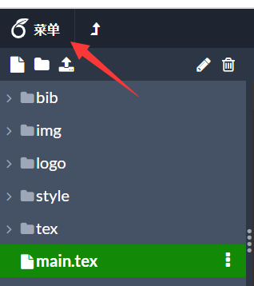
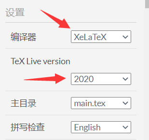

# 论文审阅

## 注意
1. 如果是新建的空项目，之后学生上传本地的源码，必须设置编译器
    
 
        
    
 
    
 
        
    
 
2. 如果是从模板新建的项目，无需设置

## Why
1. 因为Latex的编译结果是PDF，不管是源码和PDF用于审阅和管理不是很方便
2. 所以老师可以借助Overleaf来管理和审阅学生的论文

## How
1. 首先老师和学生都注册好Overleaf账号，参考[在线使用](overleaf.md)
2. 老师先从模板新建一个项目，稍微修改一下论文名字，把项目共享给学生
3. 学生在本地完成论文，并且上传到Overleaf
4. 老师可以看到学生的修改历史，并且审阅论文
5. 学生根据老师的意见修改论文
6. 老师再次审阅
7. 具体用法请参考[视频](https://www.bilibili.com/video/BV1dA411v7MW?p=29)