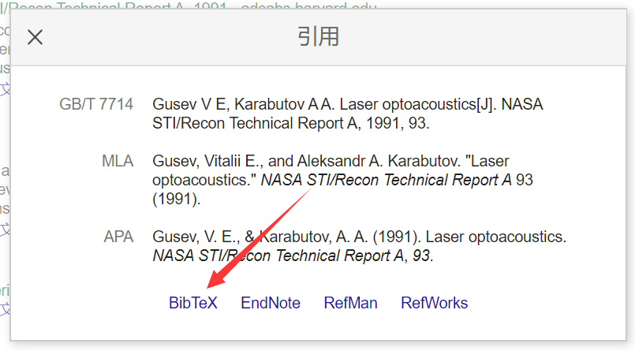

# 用户手册

## 注意
1. overleaf在线使用，直接从"模板的结构"开始阅读
2. 本模板只在windows10和Ubuntu1604下测试

## 模板的编译

### 下载模板
1. [zsc-cs-latex-thesis](https://gitee.com/yeyunxiaopan/zsc-cs-latex-thesis)
2. 利用命令 `git clone https://gitee.com/yeyunxiaopan/zsc-cs-latex-thesis.git`
<!-- 3. 或者直接下载zip，然后解压
   <div align=center> 
      
   </div>   -->

### 编译模板 
1. 模板的目录下有编译脚本，可以用于编译生成PDF
2. Windows下双击运行 make.bat
   Linux下执行 `bash make.sh`
3. 编译结果在tmp目录下，包括main.pdf文档，以及相关的中间文件

### TeXstudio中使用模板
1. 文件 -> 打开 -> main.tex 
2. 工具 -> 构建并查看
   - 或者 F5 
   - 或者 绿色双三角按钮 
3. 完成编译，并在TeXstudio右侧显示PDF的预览
4. 注意，编译结果不在tmp目录，而是和main.tex同目录
5. 工具 -> 清理辅助文件 可以清空编译的中间文件
6. tex源码和PDF文档的相互对应
   - 在tex源码，右击鼠标 -> 跳转到pdf
   - 在pdf文档，右击鼠标 -> 跳转到源
 

## 模板的结构
```
thesis 
|   main.tex (tex源码，其input了tex目录中的文件)
|   make.bat (Windows编译脚本)
|   make.sh  (Linux编译脚本)
|   
+---bib 
|       gbt7714-numerical.bst (参考文献样式)
|       ref.bib (BIBTEX参考文献数据库文件)
|       
+---img (论文中需要插入的图片放到此目录)
|       fig1.png (图片)
|       ...
|       
+---logo (学校的logo)
|       logo.png
|       uestc.pdf
|       
+---style
|       zsccode.sty    (源代码样式)
|       zscexample.sty (例子样式)
|       zscthesis.cfg  (配置文件)
|       zscthesis.cls  (封装导言区，需要额外的宏包，在此添加)
|       
+---tex (如果增加新的章节，先在此目录下增加tex文件，再修改main.tex)
|       frontinfo.tex       (封面)
|       abstract-ch.tex     (中文摘要)
|       abstract-en.tex     (英文摘要)
|       content.tex         (目录，图目录，表目录，如无需要，不用修改)
|       chap-1.tex          (第1章)
|       chap-2.tex          (第2章)
|       chap-3.tex          (第3章)
|       chap-4.tex          (第4章)
|       chap-5.tex          (第5章)
|       chap-6.tex          (第6章)
|       reference.tex       (参考文献，如无需要，不用修改)
|       appendix.tex        (附录，如果没有内容，在main.tex中注释掉)
|       acknowledgement.tex (致谢)
|       declaration.tex     (独创性声明，如无需要，不用修改)
|       
\---tmp (编译结果)
    |   main.log (排版引擎生成的日志文件，供排查错误使用)
    |   main.aux (主辅助文件，记录交叉引用、目录、参考文献的引用等)
    |   main.toc (目录记录文件) 
    |   main.lof (图片目录记录文件) 
    |   main.lot (表格目录记录文件)
    |   main.bbl (BIBTEX生成的参考文献记录文件)
    |   main.blg (BIBTEX生成的日志文件) 
    |   main.out (hyperref 宏包生成的PDF书签记录文件) 
    |   main.pdf (最终的pdf文档)

```


## 模板的使用

### 基本语法 
1. 普通文本
2. 注释 `%`
3. 环境 `\begin{环境名}[可选参数]{必须参数} ... \end{环境名}`
   - 公式 `\begin{equation} ... \end{equation}`
   - 图片 `\begin{figure}[H] ... \end{figure}`
4. 命令 `\命令名[可选参数]{必须参数}`
   - 居中 `\centering`
   - 加载 `\input{tex/frontinfo.tex}`
   

### 封面 
1. tex/frontinfo.tex
2. 使用相应的命令来设置相关信息
   - 论文题目`\mytitle{}`
   - 完成时间`\completedate{}`
3. 把个人信息填入相应的`{}`中
4. 团队论文
   - 学号用`\\`分隔
   - 学生用`~`分隔
5. 多个指导老师
   - 用`\\`分隔


### 摘要  
1. 中文 tex/abstract-ch.tex
2. 英文 tex/abstract-en.tex
3. 增加摘要内容`\abstract{}`
4. 填入关键词`\keywords{}`
5. 注意，换行需要两次回车，也就是tex源码中一个空行，pdf文档才能换行

### 目录 
1. tex/content.tex
2. 包含了目录，图目录，表目录
3. 目录是自动生成的，不用手动修改


### 章节
1. tex/chap-1.tex
2. 章，使用命令`\chapter`
   - 章的序号自动添加
   - 章会自动进入目录，页眉等处
   - `\chapter{绪论}`
3. 节，使用命令`\section`，`\subsection`，`\subsubsection`
   - 节的序号自动添加
   - 除了`\subsubsection`，其它节进入目录
   - `\section{课题背景}`
4. 章节引用
   - 被引用处，使用命令`\label`添加标签 (注意：标签不能重复)
   - 引用处，使用命令`\ref`引用标签
   - `\section{目的意义}\label{sec:meaningful}`
   - `论文的目的意义见\ref{sec:meaningful}`


### 增加新的章
1. 在tex目录下新建一个chap-n.tex文件
   - 在其中按照已有章节设置格式和内容
   - 最简单的是复制已有章节，修改其标题和内容即可
2. 在main.tex中，按照章的顺序，在合适位置，使用命令`\input`
   - `\input{tex/chap-n.tex}`
3. 增加之后，目录和文档内容都会发生相应变化

### 有序列表
1. tex/chap-1.tex
2. 使用环境 `enumerate`
   ```
   \begin{enumerate}
      \item 希腊
      \item 罗马 
   \end{enumerate}
   ```
3. 不用手动添加序号
4. 可以进行列表的嵌套

### 无序列表 
1. tex/chap-1.tex
2. 使用环境 `itemize`
   ```
   \begin{itemize}
      \item 古希腊
      \item 古罗马 
   \end{itemize}
   ```

### 参考文献
1. tex/reference.tex 不用修改此文件
   - 包含参考文献的样式
   - 包含BIBTEX数据库文件
2. bib/ref.bib 被引的文献按照格式加到此文件
   - 一般的文献都可以借助google学术找到相应的bib
   - 如果实在找不到，可以手动填写
   - 例子中的`chen2005laser`是参考文献的标签 (注意：标签不能重复)，标签主要用于引用
   ```
   @book{chen2005laser,
      title={现代激光焊接技术},
      author={陈彦宾},
      volume={42},
      year={2005},
      publisher={科学出版社}
   }
   ```
3. tex/chap-1.tex 
4. 引用处使用命令`\cite`，引用文献的标签
   - `这样就可以消除个人的欲望\cite{chen2005laser}`

### 参考文献样式修改
1. 直接修改 bib/gbt7714-numerical.bst
2. 修改方法请参考文档  gbt7714.pdf
   - 在命令行运行 `texdoc gbt7714` 即可打开


#### google学术的用法
1. 搜索某个关键字，比如 laser
2. 在某个结果中找到 ”
   <div align=center> 
      
   </div>  
3. 进入引用界面
   <div align=center> 
      
   </div>  
4. 进入BibTeX
   <div align=center> 
      
   </div>  
5. 复制内容到bib/ref.bib即可

### 数学公式
1. tex/chap-2.tex
2. 行内公式
   - 使用`$ $`
   - `$e=mc^2$`
3. 行间公式
   - 使用环境`equation`
   - 如果要引用，使用命令`\label`添加标签 (注意：标签不能重复)
   ``` 
   \begin{equation}\label{eq:newton}
      \vec{F}=m\vec{a} 
   \end{equation}
   ```
4. 公式引用，使用命令`\eqref`，引用标签
   - `如公式\eqref{eq:newton}所示`


### 图片
1. tex/chap-3.tex
2. xelatex 支持的图片格式包括
   - 矢量图: .pdf .eps
   - 位图: .jpg .png .bmp
3. 图片尽量使用矢量图
   - 使用矢量图，pdf格式，可以用visio画流程图导出成pdf格式
   - 矢量图易于调整分辨率，减少空白
   - 如果实在文中空白过大，可以把大图放到附录
4. 图片文件放到img目录 
5. 插入图片
   - 使用环境`figure`
   - 使用命令`\centering`，设置位置
   - 使用命令`\includegraphics`，引入图片
   - 使用命令`\caption`，设置标题，不需要设置序号，标题会自动进入图目录
   - 使用命令`\label`，添加标签，(注意：标签不能重复)
   ```
   \begin{figure}[H]  % [H] 浮动优先级，当前位置 
      \centering % 居中
      % width=.5\textwidth 文档宽度的0.5
      % fig1图片放在img目录下，在此处引用无需img/前缀和图片格式后缀(png, jpg等)
      \includegraphics[width=.5\textwidth]{fig1} 
      \caption{图的标题}
      \label{fig:single}  % label紧接caption之后，用于引用
   \end{figure}
   ```
6. 引用图片，使用命令`\ref`，引用标签
   - `如图\ref{fig:single}所示` 


### 表格
1. tex/chap-5.tex
2. 表格 
   - 使用环境`table`
   - 使用命令`\caption`，设置标题，不需要设置序号，标题会自动进入表目录
   - 使用命令`\label`，添加标签， (注意：标签不能重复)
   - 使用环境`tabular`，设置每格内容居中`{|c|c|c|c|}`
   - 使用命令`\hline`，表示表格的横线 
   - 用`&`来分隔不同的列
   - 用`\\`来分隔不同的行
   ```
   \begin{table}[htbp] % htbp 浮动优先级
      \centering  % 居中
      \caption{一个表格}  % 表格标题
      \label{tab:tab1}  % 用于引用的label
      % 字母的个数对应列数，|代表分割线
      % l代表左对齐，c代表居中，r代表右对齐
      \begin{tabular}{|c|c|c|c|}   
         \hline  % 表格的横线 
         1 & 2 & 3 & 4 \\  % 表格中的内容，用&分开，\\表示下一行
         \hline 
         0.1 & 0.2 & 0.3 & 0.4 \\
         \hline
      \end{tabular}
   \end{table}
   ```
3. 表格引用，使用命令`\ref`，引用标签
   - `如表\ref{tab:tab1}所示`
4. 如果觉得手动添加表格较复杂，可以用编辑器(TexStudio)的表格向导生成的表格
   - TexStudio -> 向导 -> 表格向导
   <div align=center> 
      
   </div>   


### 源码 
1. tex/chap-4.tex
2. 使用自定义的环境`clan`，`matlab`等
   ```
   \begin{clan}
      #include <stdio.h>  
      int main()                  //main 入口函数  
      {  
         printf("Hello,World!"); //printf 函数打印  
         return 1;               //函数返回值  
      }   
   \end{clan}
   ```
3. 源码的格式在 style/zsccode.sty, 如果需要其它风格的源码，可以自行定制
   - 定制方法参考文档 listings.pdf
   - 在命令行运行 `texdoc listings` 即可打开

### 附录 
1. tex/appendix.tex 
2. 附录有自己的章节chapter和section，可以认为是独立的文档
3. 增加相关的附录内容
4. 如果没有附录内容，就在main.tex中注释掉


### 致谢 
1. tex/acknowledgement.tex
2. 修改致谢的内容


### 定制导言区 
1. 适合喜欢折腾的用户
2. style/zscthesis.cls 
3. 如果需要一些高级功能
   - 可以在导言区增加相应的宏包
   - 自定义命令
   - 自定义环境等

## 文件格式
1. 源代码文件 .tex 
2. .sty 宏包文件。宏包的名称与文件名一致。
3. .cls 文档类文件。文档类名称与文件名一致。
4. .bib BIBTEX 参考文献数据库文件。
5. .bst BIBTEX 用到的参考文献格式模板
6. .log 排版引擎生成的日志文件，供排查错误使用。
7. .aux LATEX 生成的主辅助文件，记录交叉引用、目录、参考文献的引用等。
8. .toc LATEX 生成的目录记录文件。
9. .lof LATEX 生成的图片目录记录文件。
10. .lot LATEX 生成的表格目录记录文件。
11. .bbl BIBTEX 生成的参考文献记录文件。
12. .blg BIBTEX 生成的日志文件。
13. .idx LATEX 生成的供 makeindex 处理的索引记录文件。
14. .ind makeindex 处理 .idx 生成的用于排版的格式化索引文件。
15. .ilg makeindex 生成的日志文件。
16. .out hyperref 宏包生成的 PDF 书签记录文件。

## 基本命令
1. 编译 xelatex bibtex
   比如我们的编译脚本中的用法
   比如TeXstudio配置选项中的用法
2. 查看帮助文档 texdoc
   比如查看宏包ctex的帮助文档 `texdoc ctex`

## 参考文档
1. [一份不太简短的LaTeX2e介绍](http://mirrors.cqu.edu.cn/CTAN/info/lshort/chinese/lshort-zh-cn.pdf)
2. [latex-talk](https://github.com/stone-zeng/latex-talk)
3. [tex-documents](https://www.latexstudio.net/page/tex-documents/)
4. [hulatex](https://www.latexstudio.net/hulatex/index.htm)
5. 各种宏包的帮助文档